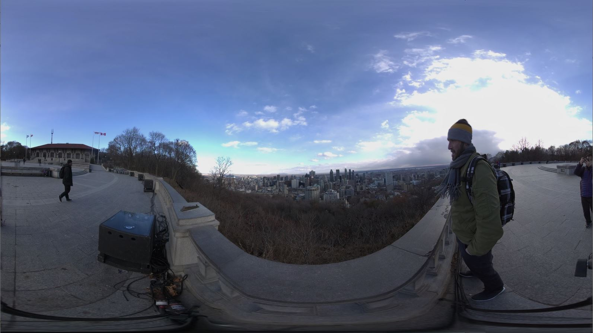
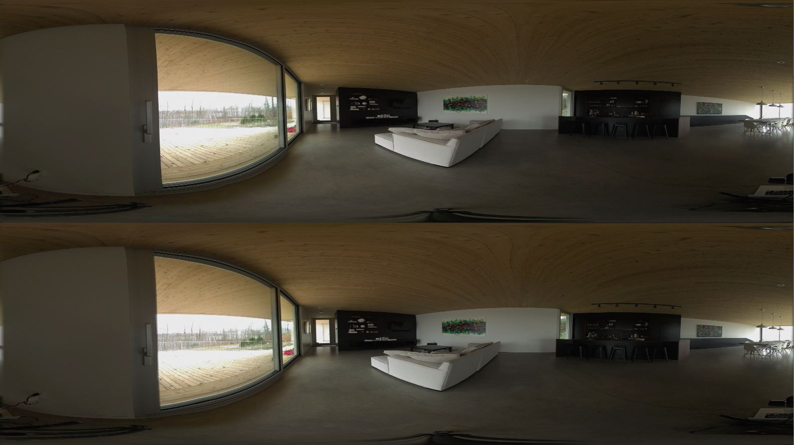
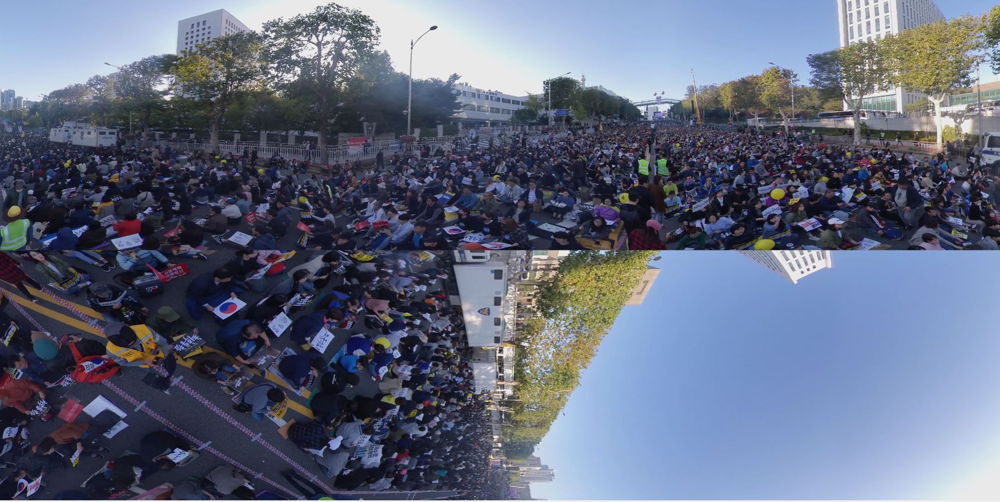

# Experience Happenings Around the World
<p align="center">
	
	
 	
</p>

<p align="center"></p>

## INSTALLATION / DOWNLOAD

Users have three options, either (1) [download the entire folder from Google Drive](whole-project-from-google-drive) which contains the whole project and the built executable, or (2) [download the "Build" folder from Google Drive](built-executable-from-google-drive) which contains only the built executable, or (3) [clone this repository and then download the missing files](clone-this-repository-and-get-the-missing-files) from Google Drive.

Project's Google Drive link: https://drive.google.com/drive/folders/1IcyC5SGtITwNdlNzdM0d2vNWOhm3cU-d?usp=sharing

### Whole Project from Google Drive
This option has the most extraneous bloat.
1. Go to project Google Drive link
2. Download the whole folder (Total size: near 16GB)

### Built Executable from Google Drive
This option won't have the Unity project.
1. Go to project Google Drive link
2. Download the "Build" folder only (Total size: near 4GB)

### Clone this repository and get the missing files
We have not tried this method, this is purely theoretically the most efficient if successful.
1. Clone this repository (less than 1GB)
2. Download the following with the Google Drive link:

#### Built only
Using the Google Drive link, download the following .resource files into the corresponding folder. (Nearly 4GB)
```
Build/ProtestExperience_Data/sharedassets1.resource
Build/ProtestExperience_Data/sharedassets2.resource
Build/ProtestExperience_Data/sharedassets3.resource
Build/ProtestExperience_Data/sharedassets4.resource
Build/ProtestExperience_Data/sharedassets5.resource
```

#### Unity project
Using the GoogleDrive link, download the following video files in .mp4 format <b>BEFORE</b> opening the project in Unity. (Nearly 4GB)
```
Assets/Interactive360/Videos/ABCHongKong2VidAud.mp4
Assets/Interactive360/Videos/ABCHongKongVidAud.mp4
Assets/Interactive360/Videos/CitizenSeoulVidAud.mp4
Assets/Interactive360/Videos/NYT_Falluja_VidAud.mp4
Assets/Interactive360/Videos/UnknownBeirutVidAud.mp4
```

## RUN & PLAY
Once there is all the .resource files in "Build\ProtestExperience_Data\", the user can choose to run the "ProtestExperience.exe" in the folder "Build". 

If the user has downloaded the .mp4 files into "Assets\Interactive360\Videos\", the user can choose to run in Unity editor.

## INSTRUCTIONS
<p align="center"><b>Use Right controller main trigger while raycast on menu button to change videos</b></p>
<p align="center"></p>
<p align="center"><b>Press B on Right controller to make Menu UI disappear</b></p>
<p align="center"></p>
<p align="center"><b>Press Y on Left controller to go back to main menu scene</b></p>
<p align="center"></p>
<p align="center"><b>Use Right controller main trigger while ray cast on play/pause button to play/pause video</b></p>
<p align="center"></p>

<p align="center"><b>THERE IS NO PLAYBACK OR MOVEFORWARD BUTTON, USER IS COMMITTED TO THE ENTIRE VIDEO ONCE LOADED</b></p>

## CONTENT
### NYT Fallujah (11:09)
<a href="https://www.youtube.com/watch?v=_Ar0UkmID6s">The Fight for Falluja</a> is produced by the New York Times. Released 11 August 2016, the video aims to have viewers "experience firsthand the battles Iraqi forces endured to retake the important strategic city of Falluja from ISIS" - from video description.

### ABC Hong Kong (6:27)
<a href="https://www.youtube.com/watch?v=2vvyTH3I2pA">Among the Hong Kong protesters in Tsim Sha Tsui</a> is produced by ABC News Australia. Released 6 August 2019, the video aims to have viewers experience a night where "Hong Kong protesters surrounded the police station in the Kowloon district of Tsim Sha Tsui, police moved in firing tear gas to push the crowds back" - from video description.

### Citizen Beirut (1:05)
<a href="https://www.youtube.com/watch?v=4l6XrqLWu3A">Downtown Beirut Freedom Demonstration October 2019</a> is uploaded by user Maher Iskandar who gives credit to Yves Ackaouy. Released 20 October 2019, the video captured the Beirut demonstration singing the Lebanese anthem. The protest "constitute a reaction against sectarian rule, endemic corruption in the public sector, legislation (such as banking secrecy) that is perceived to shield the ruling class from accountability and failures from the government to provide basic services such as electricity, water and sanitation. It is suspected that the direct trigger to the protests were due to the planned taxes on gasoline, tobacco and online phone calls such as through WhatsApp" - from Wikipedia.

### Citizen Seoul (2:55)
<a href="https://www.youtube.com/watch?v=vMIi5bU-Wuo">9th Candle Protest for reformation of prosecution</a> is uploaded by user "donggi cho". Released 16 Oct 2019, the video depicts a protest in Seoul, Korea. It is unknown if this is a pro-resignation demonstration or counter demonstration for the current Korean president Moon Jae-in amidst a corruption scandal of his justice minister Cho Kuk, though likely to be an pro-resignation protest. The scene is remarkable for showing how organized a protest can be. (maybe someone who know Korean can help?).

## INTERESTING TECHNICAL CHALLENGES

### YouTube Format for 360 Videos, Unity Video Filetype, and Open Source Solution

#### Unique 360 Format
Since all our videos were sourced from YouTube, it was important that the format of video provided match with <a href="https://docs.unity3d.com/Manual/VideoPanoramic.html">what Unity was capable of rendering</a>. Unity can render "Equirectangular" (no depth, 2D), "Cube Map" (for static usage), or "Over / Under" on its skyboxes. However, from early 2018, YouTube videos if downloaded using the common video downloaders on the internet, will have YouTube's own 3D format. People speculated that this is YouTube's decision to make videos optimized for areas that viewers are likely to watch. But this does not help development for Unity and we struggled on this problem for quite a bit.
<p align="center"><b>1) Unity approved: Equirectangular</b></p>
<p align="center"></p>
<p align="center"><b>2) Unity approved: Over / Under (each half is for a different eye)</b></p>
<p align="center"></p>
<p align="center"><b>3) Unity approved: Cube Map (static only)</b></p>
<p align="center"></p>
<p align="center"><b>4) YouTube's format (notice how the bottom half is rotated 90 degrees)</b></p>
<p align="center"></p>

#### Deep in Discussion Thread
The solution came from an <a href="https://github.com/ytdl-org/youtube-dl/issues/15267">github issue discussion</a> in January 2018 by collaborators of youtube-dl, an open source program to download YouTube videos from the command line. There were several workarounds mentioned in the thread that involved other programs and even browser extensions, we tried them but they don't work anymore. Deeper into the thread, in May 2018, the collaborators were able to find out a weird trick with youtube-dl where with the ```--user-agent ""``` flag (noting to YouTube servers that this is not a human trying to reach their servers), the video stream retrieved from YouTube would be the "Over / Under" format. Using <a href="https://youtube-dl.org/">youtube-dl</a>, we were able to finally download a Unity-approved 360 video, though now it's of "Equirectangular" format.

#### Filetypes and Another Open-Source Solution
The problem with youtube-dl was that it only download specific streams from YouTube. As such, the video and audio stream would be split into two, usually video into .mp4 or .webm, audio into .m4a or .webm . (1) youtube-dl can merge separate streams into .mkv but that filetype is <a href="https://docs.unity3d.com/Manual/VideoSources-FileCompatibility.html">not supported by Unity</a>. (2) Attempt at using Handbrake to encode videos into mp4 from mkv is succesful but loses the audio. (3) keep the video and audio separate and put them into the project leads to bugs. And finally, (4) download and merge only webm filetype (Unity approved) leads to video codecs not yet recognized by Unity (Unity still works on the older version of codec vp8 instead of YouTube's current vp9). 

In the end, another open source program came to the rescue. <a href="https://www.ffmpeg.org/">ffmpeg</a> was used to merge the .m4a audio stream (first converted to .mp3) with the .mp4 video stream into a nice and clean .mp4 video that is fully supported by Unity and the project configurations.

#### Useful youtube-dl & ffmpeg Commands:
With youtube-dl, find out streams of video, their aspect ratio and format:
```powershell
.\youtube-dl.exe --user-agent "" URL https://www.youtube.com/watch?v=4l6XrqLWu3A -F
```
With youtube-dl, download the exact stream provided by YouTube:
```powershell
.\youtube-dl.exe --user-agent "" URL https://www.youtube.com/watch?v=4l6XrqLWu3A -f 138
```
With ffmpeg, merge audio and video streams:
```powershell
.\ffmpeg -i UnknownBeirut.mp4 -i UnknownBeirutAudio.mp3 -map 0:v -map 1:a -c:v copy -c:a copy UnknownBeirutVidAud.mp4 -y
```

### Controllers and Legacy System

## MOTIVATIONS

## AUTHOR

## ACKNOWLEDGEMENTS
